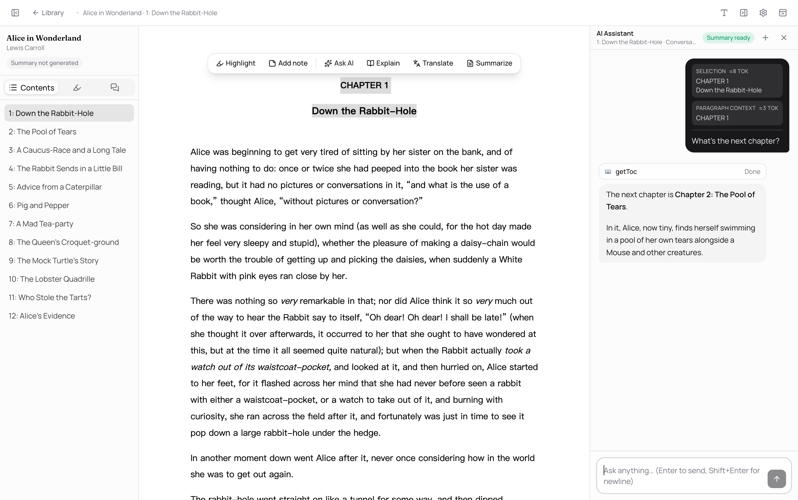

<div align="center">


# Marginalia

**Talk to AI in the margins.**

A desktop AI reader for ePub and PDF books.

English · [简体中文](README.zh-CN.md)

</div>



## What is Marginalia

Marginalia puts AI right in the margins of your reading. Open an ePub or PDF, hit a sentence you want to dig into, **select it**, and an assistant joins you in the side panel — already holding the context of the book. Explain an allusion, translate a passage, summarize the thread, or just ask. No breaking your flow, no copy-pasting into another window.

It's local-first, bring-your-own-key, and tied to no single model provider — your books and notes stay quietly on your own machine.

## ✨ Features

### 🪄 Ask by selecting — the core

Select text in an ePub or text-layer PDF and a floating toolbar appears: **Explain / Translate / Summarize** in one click, or hit "Ask AI" for an open question. Answers **stream** into the side panel, so you can read and ask in the same breath.

### 🧩 Transparent context

Every question ships its context as visible, toggleable **chips**: your exact selection, its surrounding paragraph, the chapter summary, the whole-book summary — each labeled, each switchable. **You always know what the AI sees.**

### 🖍️ Highlights & notes

Five highlight colors plus underline, with sticky notes on any passage. Every annotation collects into a side-panel list in reading order — one click jumps you back to the spot.

### 📖 Immersive reading

Real, continuously-scrolling reading that remembers and restores your place. ePub gets tuneable typography; PDF gets fit-to-width rendering, zoom controls, clickable links, and text-layer selection when the document provides text. Switch between dark / light / system themes anytime.

### 🗂️ Cover-wall library

An Apple Books-style cover wall to spot your books at a glance. **Drag an ePub or PDF into the window** to import it; books without a cover get a tasteful generated tile.


### 🔌 Bring your own key, any provider

Connect OpenAI, Anthropic, Google, or any **OpenAI-compatible endpoint** (self-hosted gateway or proxy).

### 🌍 Local-first · bilingual

A bilingual interface (English / 简体中文) that follows your system language. Everything lives on your machine — no uploads, no account required.

## 📦 Installation

### Homebrew (recommended)

```bash
brew tap eurfelux/tap
brew install --cask marginalia
```

The cask clears the quarantine flag for you, so the app opens right away — no Gatekeeper hoops.

### Manual download

Grab the latest `.dmg` from [Releases](https://github.com/EurFelux/marginalia/releases), open it, and drag Marginalia into Applications.

> [!IMPORTANT]
> **macOS will warn that the app "cannot be verified"** on first launch — Marginalia is ad-hoc signed but not notarized by Apple (that requires a paid developer certificate). To open it anyway:
>
> 1. Double-click the app once (the warning appears) — then go to **System Settings → Privacy & Security**, scroll down, and click **Open Anyway**.
> 2. Or, from a terminal: `xattr -d com.apple.quarantine /Applications/marginalia.app`
>
> The app is open source — you can always audit the code and build it yourself with `pnpm make`.

## 🪄 A glance at getting started

1. **Drop in a book** — drag an ePub or PDF into the library and start reading.
2. **Select text, hit "Ask AI"** — the side panel picks up the passage's context automatically.
3. **Watch the answer stream in** — read, annotate, follow up, and summarize, all in one window.

## 🧭 Principles

- **Transparent context** — every piece of context sent to the AI is shown and switchable.
- **Local-first** — books, progress, notes, and conversations stay on your own machine.
- **No lock-in** — bring your own API key, switch models and providers freely.

## License

[GPL-3.0-or-later](LICENSE) © 2026 eurfelux
