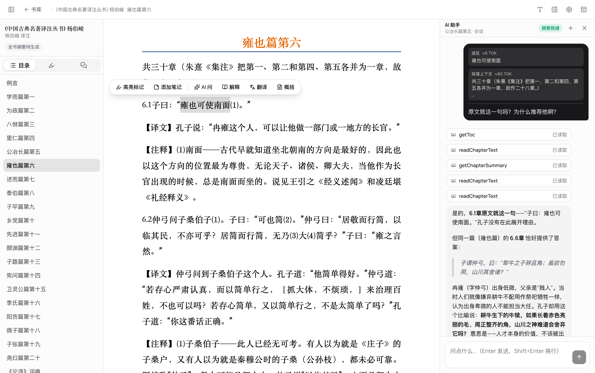
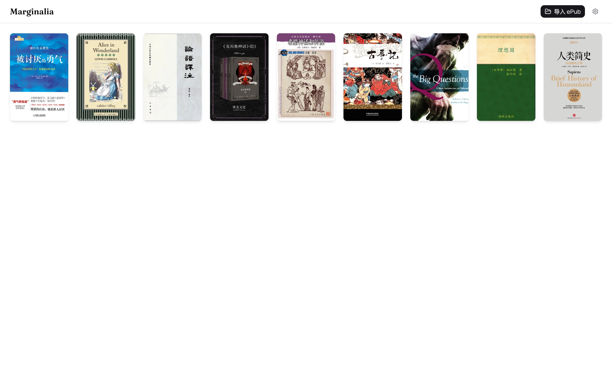

# Marginalia

**在书页边上，和 AI 对话。**

一款支持 ePub 与 PDF、懂你正在读什么的桌面 AI 阅读器。

[English](README.md) · 简体中文

## Marginalia 是什么

Marginalia（页边批注）把 AI 放进了阅读的「页边」。打开 ePub 或 PDF，读到一句想深究的话，**选中它**，AI 就带着这本书的上下文在侧栏陪你聊——解释典故、翻译段落、概括脉络，或者随便问；想听的时候，它也能把书读给你听。不打断阅读，也不用复制粘贴到别的窗口。

它本地优先、自带 key、不绑定任何一家模型服务商——你的书和笔记都安静地待在自己的电脑里。

## ✨ 核心特性

### 🪄 划词即问 —— 核心

选中 ePub 正文或带文本层的 PDF 文字，浮动工具栏即刻出现：一键 **解释 / 翻译 / 概括**，或点「问 AI」自由提问。回答在侧栏**流式**呈现，你边读边问，思路不断。

### 🔊 也能读给你听

点下播放，Marginalia 便逐段朗读全书——高亮正在读的那一行、自动滚动跟随，跨章节连贯不断。可按语言各选一个 voice、调节语速；它用的是你机器上现成的系统语音，声音不出本机。

### 🧩 透明的上下文

每次提问，喂给 AI 的上下文都拆成可见、可开关的 **chip**：你选中的原文、所在段落、本章摘要、全书摘要——逐块标注、随手开关。**你永远知道 AI 看到了什么。**

### 🧠 是伙伴，不只是聊天机器人

给助手起个名字、写一段**人设**和长期指令，它便以这副模样出现在每一次对话里。它还能跨对话**记住**要紧的事——而每一条记忆都由你查看、编辑、删除，也可以整个关掉。每本书各自保存自己的会话，你可以回到旧的话头，也可以另起一段。

### 🖍️ 标注、便签与笔记本

5 种高亮颜色 + 下划线，给任意段落随手贴便签——全部按阅读顺序汇成侧栏列表，一点即可跳回原处。每本书还配一个自由书写的 **Markdown 笔记本**，安放那些不属于某一行的念头。

### 📖 沉浸式阅读

连续滚动阅读，自动记忆并恢复进度。ePub 支持字号、行高、页宽调节；PDF 支持适宽渲染、缩放、超链接点击，并在文档有文本层时支持选区问 AI。深色 / 浅色 / 跟随系统三档随时切换。

### 🗂️ 封面墙书库

Apple Books 风的封面墙，一眼找到你的书。把 ePub 或 PDF 文件**拖进窗口**即导入；没有封面的书也会生成好看的配色占位。

### 🔌 自带 key，多服务商

接 OpenAI、Anthropic、Google，或任意 **OpenAI 兼容端点**（自建网关 / 代理皆可）。

### 🌍 本地优先 · 双语

界面中英双语、跟随系统语言。数据全部存在本机，不上传、不依赖账号。

## 🪄 上手一瞥

1. **拖入电子书** —— 把 ePub 或 PDF 拖进书库，立刻开读。
2. **选中文字，点「问 AI」** —— 浮动工具栏一点，侧栏自动带上这句话的上下文。
3. **看 AI 流式回答** —— 边读边聊，标注、追问、概括都在同一个窗口里完成。
4. **打造你的专属助手** —— 给助手起名、写人设，让它在一次次对话间记住要紧的事。

## 🧭 设计理念

- **上下文透明** —— 喂给 AI 的每一块内容都摆在明面上，可见、可关。
- **本地优先** —— 书、进度、笔记、对话都存在你自己的电脑里。
- **不锁定** —— 自带 API key，自由切换模型与服务商，你说了算。

## 许可证

[GPL-3.0-or-later](LICENSE) © 2026 eurfelux
