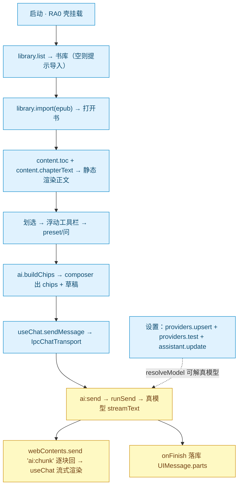
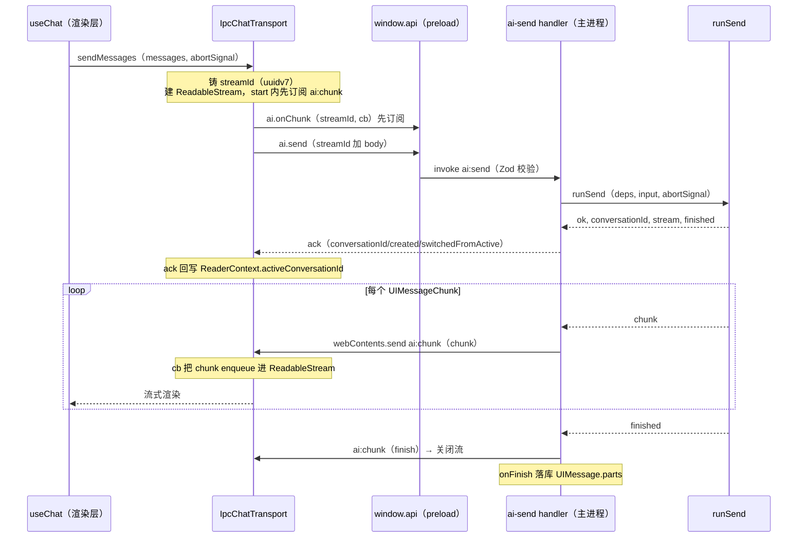
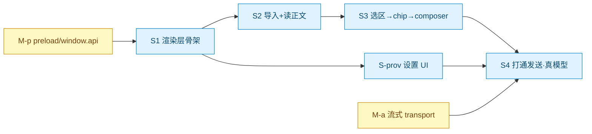

# Marginalia · 最小可用竖切设计文档

> 状态：设计已确认，待落实施计划
> 日期：2026-06-01
> 轨道：**渲染层轨（RA）首个竖切**——打通端到端「导入 → 读 → 选 → 问 → 真模型流式回复」最小可用版，产出后落 bite-sized plan → subagent 实现。
> 上游：[`renderer-track-decomposition`](../plans/2026-06-01-marginalia-renderer-track-decomposition.md) §2 推进策略、§5 竖切焦点、§7 选型——本文档是对 §7 拍板后的设计收敛。
> 关联：[`core-reading-loop-design`](2026-05-31-marginalia-core-reading-loop-design.md)、[`up1-ui-prototype-design`](2026-06-01-marginalia-up1-ui-prototype-design.md)；已完成主进程 [MA1–MA5](../plans/2026-05-31-marginalia-ma5-streaming-orchestration.md)。

---

## 1. 目标与非目标

**目标**：在真实 Electron 渲染层（替换 `src/renderer.ts` 模板桩）打通**一条端到端可真用的最小链路**：导入样例 ePub → 读到真实章节正文 → 划选文本 → 触发 AI → **真模型**流式回复落到消息列表。

**工作单元映射**（取自分解 §5，竖切 = 全量工作单元的最小子集）：

| 代号       | 范围                                          | 对应全量单元 |
| ---------- | --------------------------------------------- | ------------ |
| **M-p**    | preload / `window.api` 契约闭合（竖切子集）   | M-p          |
| **M-a**    | 流式 IPC transport（主进程新件）              | M-a          |
| **S1**     | 渲染层骨架：桩→React 挂载 + Tailwind + 两栏   | RA0 最小     |
| **S2**     | 导入 + 读真实正文（静态文本，无 epub.js/CFI） | RA1 最小     |
| **S3**     | 选区→工具栏→chip→composer（字符偏移，无 CFI） | RA2 最小     |
| **S-prov** | Provider/设置 UI（仅 Anthropic）              | RA5 最小     |
| **S4**     | 打通发送（真模型流式）                        | RA2 最小     |

**非目标（刻意推迟，见 §10）**：epub.js 真实分页 / CFI · 标注与笔记(RA3) · 跨章会话(M-c/RA4) · 全书摘要(M-d) · i18n / 主题切换 · 打包(D1) · 多 provider 类型 · `reconnectToStream` 断线重连。

---

## 2. 设计决策（拍板表）

本文档的设计前提，逐条已与产品方确认：

| #   | 决策点               | 结论                                                                                                                                  |
| --- | -------------------- | ------------------------------------------------------------------------------------------------------------------------------------- |
| 1   | M-a 流式载体         | `webContents.send` 事件增量流 + **渲染层铸 `streamId`** 解复用 + 独立 `ai:abort` 通道                                                 |
| 2   | M-a 渲染层消费       | **AI SDK v6 `useChat` + 自定义 `IpcChatTransport`**；主进程是会话历史唯一真源                                                         |
| 3   | RA0 技术栈           | 纯 React 19 + Vite（**无 router / 无 SSR**）；保留 react-compiler；Tailwind 4 经 `@tailwindcss/vite`；Manrope/Fraunces **本地 woff2** |
| 4   | 状态分层             | **TanStack Query**（main 来的持久态）/ **zustand**（纯 UI 态）/ **useChat**（活跃流式对话），三者职责不重叠                           |
| 5   | 数据获取（非聊天）   | TanStack Query，默认项适配「本地 IPC 非网络」                                                                                         |
| 6   | S-prov provider 类型 | **仅 Anthropic 单一类型**（apiKey 单字段 + 连通测试 + 选默认 assistant）                                                              |

**关键洞察（贯穿全文）**：渲染层与主进程之间是**本地 IPC（`ipcRenderer.invoke` → better-sqlite3 同步快查）**，不是网络。故 TanStack Query / `useChat` 的网络向卖点（去重、`stale-while-revalidate`、focus 重验、重试、断线重连）大多收益打折——我们要的是它们的 **hook 化 loading/error 态** 与 **声明式失效 / 流式消息建模**。

---

## 3. 总体架构与数据流

### 3.1 端到端流程



### 3.2 三层职责（沿用「主进程厚 / 渲染层薄」硬性规则）

- **主进程**：全部业务逻辑——DB、ePub 解析、Provider/密钥、Prompt 组装、`runSend` 流式 Agent 循环。竖切只在主进程**新增 M-a transport 接线**（`ai:send`/`ai:abort`/`ai:chunk`）与 M-p 契约暴露，不动既有业务纯函数。
- **preload**：`contextBridge` 暴露 typed `window.api`（M-p），是渲染层唯一数据入口。
- **渲染层**：UI 展示 + 三类状态（见 §6.4），不直接手写 channel。

---

## 4. M-a：流式 IPC transport（核心）

### 4.1 关键决策：主进程是会话历史唯一真源

`useChat` 在渲染层维护的 `messages` 数组**仅用于渲染 / 流式视图**。自定义 `IpcChatTransport` **忽略** `sendMessages` 传入的 `options.messages`，只把「本轮 `userText` + `chips` + `bookId` / `currentChapterId` / `activeConversationId`」经 `body` 发给主进程。主进程 `runSend` 仍按 MA4 **从 DB 装配 prompt**（`assemblePrompt`），不接受渲染层灌入的历史——保住服务端组装架构不被掏空。

会话**初值**：打开会话时用 `messages:list-by-conversation` 取已存 `MessageDto.parts`（即 `UIMessage["parts"]`）映射为 `UIMessage[]`，作为 `useChat` 的 `messages` 初值，让切面有历史可显。

### 4.2 IPC 协议

新增 3 个通道（加入 `src/shared/ipc.ts` 的 `IPC` 常量）：`aiSend: "ai:send"`、`aiAbort: "ai:abort"`、`aiChunk: "ai:chunk"`。

| 方向 | 通道       | 机制                 | 载体形状                                                                                                            |
| ---- | ---------- | -------------------- | ------------------------------------------------------------------------------------------------------------------- |
| R→M  | `ai:send`  | `ipcRenderer.invoke` | 入参 `SendRequest`；返回 `SendAck`                                                                                  |
| R→M  | `ai:abort` | `ipcRenderer.invoke` | 入参 `{ streamId }`；返回 `void`                                                                                    |
| M→R  | `ai:chunk` | `webContents.send`   | `AiStreamEvent`：`{streamId,type:"chunk",chunk}` \| `{streamId,type:"finish"}` \| `{streamId,type:"error",message}` |

### 4.3 入站校验 / 出站信任 原则

- **入站（R→M：`ai:send` / `ai:abort`）**：不可信入参，经现有 `registry.handle` → `validateInput` 的 Zod 校验。
- **出站（M→R：`ai:chunk`）**：主进程自产的可信数据，**不走 Zod**；且 `UIMessageChunk` 是 AI SDK 的复杂联合类型，Zod 化不现实，仅以 TS 类型 `AiStreamEvent` 约束两端。

### 4.4 防竞态：渲染层铸 `streamId`

`streamId` 由**渲染层**用 `uuidv7` 铸造并随 `ai:send` 传入。`IpcChatTransport` 在 `new ReadableStream` 的 `start()`（构造时同步执行）里**先订阅** `ai:chunk`（按 `streamId` 过滤），**再** invoke `ai:send`；主进程只有收到 `ai:send` 才知道该 `streamId` 并开始推送——**订阅必早于推送，无竞态**。

### 4.5 Zod 单源（落 `src/shared/chat.ts`）

复用既有 `chipSchema`，新增：

```ts
// src/shared/chat.ts —— 新增（chipSchema 已存在，原样复用）

/** runSend 的业务入参（不含传输层的 streamId）。取代 send.ts 中手写的 SendInput interface。 */
export const sendInputSchema = z.object({
  bookId: z.string().min(1),
  currentChapterId: z.string().min(1),
  activeConversationId: z.string().min(1).nullable(),
  chips: z.array(chipSchema),
  userText: z.string().min(1),
});
export type SendInput = z.infer<typeof sendInputSchema>;

/** ai:send 入站载体 = 业务入参 + 渲染层铸的 streamId。 */
export const sendRequest = sendInputSchema.extend({ streamId: z.string().min(1) });
export type SendRequest = z.infer<typeof sendRequest>;

/** ai:send invoke 的同步 ack（不含 stream/finished——增量走 ai:chunk 事件流）。 */
export const sendAck = z.discriminatedUnion("ok", [
  z.object({
    ok: z.literal(true),
    conversationId: z.string(),
    created: z.boolean(),
    switchedFromActive: z.boolean(),
  }),
  z.object({ ok: z.literal(false), reason: z.string() }),
]);
export type SendAck = z.infer<typeof sendAck>;

/** ai:abort 入参。 */
export const abortInput = z.object({ streamId: z.string().min(1) });
export type AbortInput = z.infer<typeof abortInput>;

/** ai:chunk 出站事件（main→renderer，不 Zod；UIMessageChunk 来自 ai SDK）。 */
import type { UIMessageChunk } from "ai";
export type AiStreamEvent =
  | { streamId: string; type: "chunk"; chunk: UIMessageChunk }
  | { streamId: string; type: "finish" }
  | { streamId: string; type: "error"; message: string };
```

`src/main/ai/send.ts` 改造：删除手写的 `SendInput` interface（当前 16–22 行），改 `import { type SendInput } from "@shared/chat"`。`runSend` 签名形态不变（仍 `runSend(deps, input)`），仅入参类型来源从本地 interface 切到 shared 单源。

### 4.6 `IpcChatTransport`（渲染层，实现 `ChatTransport`）

```ts
// src/renderer/ai/ipc-chat-transport.ts（示意，约 40 行）
import type { ChatTransport, UIMessage, UIMessageChunk } from "ai";
import { v7 as uuidv7 } from "uuid";
import { useReaderStore } from "@renderer/store/reader-store";

export function createIpcChatTransport(): ChatTransport<UIMessage> {
  return {
    async sendMessages({ messages, abortSignal }) {
      const streamId = uuidv7();
      // transport 是非组件代码 → 直接 getState() 读 store，无需注入 setter。
      // userText 取 messages 末条用户输入；历史不上送（§4.1）。
      const { bookId, currentChapterId, activeConversationId, draftChips } =
        useReaderStore.getState();
      const userText = lastUserText(messages);
      let unsub: (() => void) | undefined;
      const stream = new ReadableStream<UIMessageChunk>({
        start(c) {
          unsub = window.api.ai.onChunk(streamId, (ev) => {
            if (ev.type === "chunk") c.enqueue(ev.chunk);
            else if (ev.type === "finish") (c.close(), unsub?.());
            else (c.error(new Error(ev.message)), unsub?.());
          });
        },
        cancel() {
          void window.api.ai.abort({ streamId });
          unsub?.();
        },
      });
      abortSignal?.addEventListener("abort", () => void window.api.ai.abort({ streamId }));
      const ack = await window.api.ai.send({
        streamId,
        bookId,
        currentChapterId,
        activeConversationId,
        chips: draftChips,
        userText,
      });
      if (!ack.ok) {
        unsub?.();
        throw new Error(ack.reason); // useChat 进 error 态
      }
      useReaderStore.getState().setActiveConversation(ack.conversationId); // 组件外直接回写
      return stream;
    },
    // 单窗口竖切不需断线重连：返回空流。
    reconnectToStream: async () => null,
  };
}
```

> transport 作为非组件代码，本轮上下文（book/章/会话/chips）直接 `useReaderStore.getState()` 读、`ack` 也走 `getState().setActiveConversation` 回写——无需把 setter 闭包注入工厂。`userText` 取 `messages` 末条用户输入，历史不上送（§4.1）。

### 4.7 主进程 handler + `SendDeps` 工厂 + abort 接线

**`registry.handle` 小幅扩展**：现有签名 `handler: (input: I) => O | Promise<O>` 扩为 `handler: (input: I, event: IpcMainInvokeEvent) => O | Promise<O>`（向后兼容，既有 handler 忽略第二参）。`ai:send` 需 `event.sender` 来 `webContents.send`。

```ts
// src/main/ipc/ai-handlers.ts（新增）
const controllers = new Map<string, AbortController>();

export function registerAiHandlers(): void {
  handle(IPC.aiSend, sendRequest, async (req, event) => {
    const { streamId, ...input } = req;
    const controller = new AbortController();
    controllers.set(streamId, controller);

    const result = runSend(makeSendDeps(), input, { abortSignal: controller.signal });
    if (!result.ok) {
      controllers.delete(streamId);
      return { ok: false, reason: result.reason };
    }
    void pump(event.sender, streamId, result, controllers); // 异步泵送，不阻塞 ack
    return {
      ok: true,
      conversationId: result.conversationId,
      created: result.created,
      switchedFromActive: result.switchedFromActive,
    };
  });

  handle(IPC.aiAbort, abortInput, ({ streamId }) => {
    controllers.get(streamId)?.abort();
    return undefined;
  });
}

async function pump(sender, streamId, result, controllers) {
  try {
    for await (const chunk of result.stream) {
      sender.send(IPC.aiChunk, { streamId, type: "chunk", chunk });
    }
    await result.finished;
    sender.send(IPC.aiChunk, { streamId, type: "finish" });
  } catch (err) {
    sender.send(IPC.aiChunk, { streamId, type: "error", message: String(err) });
  } finally {
    controllers.delete(streamId);
  }
}
```

**`makeSendDeps()` 生产工厂**（落 `src/main/ai/send-deps.ts` 或 ai-handlers 内）——把 Electron 侧依赖注入 `runSend` 纯函数：

- `db`: `getDb()`
- `loadBytes`: 从 library 读 ePub 字节（复用 MA2 既有读取）
- `resolveModel`: 包 MA3 `getDefaultAssistant` + provider 密钥解出 `ResolvedModel`（未配 key → `{ ok:false, reason }`）
- `ensureSummary`: 章摘懒生成偏函数（fire-and-forget，自含 reject 兜底）

**`runSend` abort 接线**（主进程补口）：`runSend` 增加可选第三参 `opts?: { abortSignal?: AbortSignal }`，将 `abortSignal` 透传给内部 `streamText({ ..., abortSignal })`。`ai:abort` → `controller.abort()` → `streamText` 中断 → `pump` 的 `for await` 抛出 → 发 `error`（或视 abort 为正常收尾，按 `runSend` 既有「abort 不落库」语义处理）。

### 4.8 发送时序



---

## 5. M-p：`window.api` 契约面（竖切子集）

> **shared 结构纠偏**：schema **按领域拆文件**——`ipc.ts`（通道名 + ping/app）、`chat.ts`、`library.ts`、`providers.ts`、`assistant.ts`、`types.ts`。CLAUDE.md「各通道 Zod schema 均在 `ipc.ts`」一项与现状不符，**待更正**。M-p 各方法复用对应领域文件既有 schema/DTO，**不重定义**。

`preload.ts` 按领域分组暴露 typed `window.api`（全部基于 `ipcRenderer.invoke`，唯 `ai.onChunk` 用 `ipcRenderer.on`）：

| 分组       | 方法                                                                                      | 复用 schema/DTO 源                       |
| ---------- | ----------------------------------------------------------------------------------------- | ---------------------------------------- |
| `library`  | `import(path) / list() / get(bookId)`                                                     | `@shared/library`                        |
| `content`  | `toc(bookId) / chapterText(bookId, chapterId)`                                            | `@shared/library` 或 `@shared/types`     |
| `settings` | `providers.list/upsert/test/remove`、`assistant.getDefault/update`                        | `@shared/providers`、`@shared/assistant` |
| `ai`       | `buildChips(input) / send(SendRequest) / abort({streamId}) / onChunk(streamId, cb)→unsub` | `@shared/chat`                           |
| `chat`     | `conversations.listByBook(bookId)`、`messages.listByConversation(id)`                     | `@shared/chat`                           |

`onChunk` 实现：

```ts
onChunk(streamId: string, cb: (ev: AiStreamEvent) => void): () => void {
  const listener = (_e: IpcRendererEvent, payload: AiStreamEvent) => {
    if (payload.streamId === streamId) cb(payload);
  };
  ipcRenderer.on(IPC.aiChunk, listener);
  return () => ipcRenderer.removeListener(IPC.aiChunk, listener);
}
```

竖切**不暴露** `progress:*`、`content:chapter-summary`、`conversations:create/get`、`providers:reveal`（按需后续补）。

---

## 6. RA0：渲染层地基

### 6.1 技术栈

纯 React 19 + Vite（Electron renderer，**无 router、无 SSR**——单窗口，library ↔ reader 用一个视图态切换）；保留 react-compiler（Vite 插件）；Tailwind 4 经 `@tailwindcss/vite` 接入 `vite.renderer.config.ts`；`font-sans`=Manrope / `font-serif`=Fraunces，**本地 woff2**（vendored 或 `@fontsource`，离线优先），走 Tailwind theme（不内联 `fontFamily`）。状态管理见 §6.4（**zustand** UI 态 + TanStack Query 持久态 + useChat 流式）。

### 6.2 文件 / Provider 结构

```
src/renderer/
├── main.tsx                    # React 挂载 + QueryClientProvider + Providers + <App/>
├── App.tsx                     # 视图态切换（library / reader）+ 三栏 shell（移植 UP1 AppShell 适配）
├── query/
│   ├── client.ts               # QueryClient（适配本地 IPC 的 defaultOptions，见 §6.3）
│   └── keys.ts                 # 查询键工厂（见 §6.3）
├── ai/
│   └── ipc-chat-transport.ts   # IpcChatTransport（§4.6）
├── store/
│   ├── reader-store.ts         # zustand：视图/书/章、选区、浮动工具栏定位、阅读偏好、activeConversationId、面板开合、draft chips/text
│   └── settings-store.ts       # zustand：设置面板 UI 态（表单草稿/测试结果）；provider/assistant 持久态走 Query
├── library/  reader/  ai-panel/  settings/   # 由 UP1 移植/新建的展示型组件
└── styles/
    ├── index.css               # @import "tailwindcss"; @theme 字体；本地 woff2 @font-face
    └── fonts/                  # Manrope / Fraunces woff2
```

> UP1 的展示型组件（Sidebar / Reader / AIPanel / Composer 等）是已评审的视觉/交互资产：**保留外观与交互，替换数据来源**（mock → `window.api` + Query + zustand + useChat）。原型用的 TanStack Start / shadcn / i18next 在渲染层**按需取舍**——竖切不上 i18n（文案直写中文，i18n 留后）。

### 6.3 数据获取层（TanStack Query）

**QueryClient 默认项**（适配本地 IPC 非网络）：

```ts
new QueryClient({
  defaultOptions: {
    queries: {
      refetchOnWindowFocus: false, // 无网络语义
      staleTime: Infinity, // 本地确定性数据；失效靠显式 invalidate
      retry: false, // IPC 失败直接报错，不靠重试
    },
  },
});
```

**查询键约定**（`query/keys.ts`）：

| 键                               | queryFn                                            |
| -------------------------------- | -------------------------------------------------- |
| `["library"]`                    | `window.api.library.list()`                        |
| `["toc", bookId]`                | `window.api.content.toc(bookId)`                   |
| `["chapter", bookId, chapterId]` | `window.api.content.chapterText(...)`              |
| `["providers"]`                  | `window.api.settings.providers.list()`             |
| `["assistant", "default"]`       | `window.api.settings.assistant.getDefault()`       |
| `["conversations", bookId]`      | `window.api.chat.conversations.listByBook(...)`    |
| `["messages", conversationId]`   | `window.api.chat.messages.listByConversation(...)` |

**写后失效映射**（`useMutation` 的 `onSuccess` → `invalidateQueries`）：

| mutation                           | 失效键                     |
| ---------------------------------- | -------------------------- |
| `library.import`                   | `["library"]`              |
| `settings.providers.upsert/remove` | `["providers"]`            |
| `settings.assistant.update`        | `["assistant", "default"]` |

### 6.4 状态分层边界

| 层                 | 管什么                                                                                                                                                                                                                              |
| ------------------ | ----------------------------------------------------------------------------------------------------------------------------------------------------------------------------------------------------------------------------------- |
| **TanStack Query** | 来自 main 的服务端 / 持久态：书、章节文本、TOC、provider、assistant、会话列表、历史消息                                                                                                                                             |
| **zustand**        | 纯渲染层 UI 态：当前视图（library/reader）、当前书/章、选区、浮动工具栏定位、阅读偏好、`activeConversationId`、面板开合、composer 草稿（`draftChips`/`draftText`）。**selector 细粒度订阅** → 高频态（选区/偏好）不拖累整章正文渲染 |
| **useChat**        | 活跃流式对话：消息流、`status`、`stop()`、错误态                                                                                                                                                                                    |

三者职责不重叠。`activeConversationId` 由 reader store 持有；`ai:send` 的 `ack` 由 `IpcChatTransport` 直接 `useReaderStore.getState().setActiveConversation(...)` 回写（非组件代码，无需注入 setter，处理 `created` / `switchedFromActive`）。

---

## 7. 切面落地 S1–S4 + S-prov

### 7.1 内部依赖



### 7.2 逐切面

| 切面       | 内容                                                                                                             | 关键组件 / 数据流                                                                                                      | 验收                                                              |
| ---------- | ---------------------------------------------------------------------------------------------------------------- | ---------------------------------------------------------------------------------------------------------------------- | ----------------------------------------------------------------- |
| **S1**     | 桩→React 挂载 + `QueryClientProvider` + Providers + Tailwind + 最小两栏 shell；消费 typed `window.api`           | `main.tsx` / `App.tsx`；`["library"]` useQuery 起一个最小读                                                            | `pnpm start` 见空壳两栏，无控制台报错                             |
| **S2**     | `library.import` 导入样例书；`content.toc` + `content.chapterText` **静态渲染**（按段落数组，不上 epub.js/CFI）  | 书库列表（`["library"]`）→ 选书 → ReaderContext 记当前书/章 → `["toc"]` / `["chapter"]` → ReaderPane 渲染段落          | 能导入并读到真实书某章文字                                        |
| **S3**     | 移植 UP1 选区 + 浮动工具栏；`ai.buildChips`（**字符偏移**取前/当/后段，不上 CFI）→ composer 出 chips + 草稿      | `useSelection`（取选区原句 + `paragraphBefore/Current/After`）→ `buildChipsInput` → `ai.buildChips` → ChipBar/Composer | 选词出工具栏；AI 问后面板出现 chips + 预填草稿                    |
| **S-prov** | 设置面板**仅 Anthropic**：apiKey 单字段 → `providers.upsert` → `providers.test` 连通 → `assistant.update` 选默认 | SettingsContext + `["providers"]` / `["assistant","default"]`；mutation 失效对应键                                     | 配好后 `resolveModel` 能解出真模型（`ai:send` 不再 `{ok:false}`） |
| **S4**     | composer 提交 → `useChat` + `IpcChatTransport` → `ai:send` → M-a 流式 → 消息列表逐字增量                         | `useChat({ transport })`；`buildBody` 从 ReaderContext 取 bookId/chapterId/activeConversationId/chips                  | **端到端**：导入→读→选→问→真模型流式回复                          |

> chip 的 `required` / `enabled` 字段当前无读取方（`chipSchema` 的 MA5 TODO）：S3 复用既有 `chipSchema`，UI toggle 的闭合留作 follow-up，不在竖切收敛。

---

## 8. 错误处理（不静默）

| 场景                           | 处理                                                                                                                   |
| ------------------------------ | ---------------------------------------------------------------------------------------------------------------------- |
| 未配 key / `resolveModel` 失败 | `ai:send` 返回 `{ ok:false, reason }` → `IpcChatTransport` 抛错 → useChat 进 error 态；composer 提示「去设置配置模型」 |
| 流中错误                       | `ai:chunk` 发 `{type:"error",message}` → `controller.error()` → useChat error 态，该条标错（仿原型 `/error`）          |
| 用户中断                       | `useChat.stop()` → abortSignal → `ai:abort` → `controller.abort()` → 中断 `streamText`；按 `runSend` 既有语义不落库    |
| 导入失败                       | `library.import` 抛可读错误 → mutation `onError` → UI toast                                                            |
| 章节读取失败                   | `["chapter"]` query error → ReaderPane 显错误态，不静默空白                                                            |

### 8.1 网络与代理

- **默认走系统代理**：所有 AI 出站请求（连通测试 / `streamText`）由主进程经 Electron `net.fetch`（Chromium 网络栈，默认采用系统代理设置）发起，作为 `fetch` 注入 AI SDK 的 provider 工厂。动机：部分地区直连 `api.anthropic.com` 会被 **403「Request not allowed」按区域拦截**，须经系统代理出网。随 **S4 真模型联网**一并接线（`resolveLanguageModel` 接受注入的 `fetch`，model-factory 保持 headless 可测——测试不注入则回退全局 fetch）。
- **错误如实透传（已落地）**：连通测试与流式错误**优先透传 provider 的真实 error message**（`getErrorMessage` 提取 `{error:{message}}` / `{error:"str"}` / `{message}` 等常见形状）；提取不到才退到 **HTTP 状态码的标准语义**并标注「可能方向」，**绝不虚构具体原因**（杜绝把 403 误报成「invalid API key」之类）。
- **可配置代理设置（自定义代理地址 / PAC / 按 provider 覆盖）推迟出 MVP**——MVP 仅「默认系统代理」。见 §10。

---

## 9. 测试策略（headless 优先）

主进程 Node ABI 可 headless 测（`:memory:` SQLite），覆盖 M-a 新件：

- `sendRequest` / `sendAck` / `abortInput` Zod 校验（合法 / 非法入参）。
- `makeSendDeps` 解析：`resolveModel` 命中真模型 vs 未配 key 返回 `{ok:false}`。
- `runSend` 既有测试 + **新增 abortSignal 中断路径**（abort 后流终止、不落库）。
- `ai:send` handler 的 **streamId → chunk\* → finish/error 事件序列**：mock `event.sender.send`，断言发出的 `AiStreamEvent` 序列与顺序。
- `registry.handle` 扩展后向后兼容（既有不接 event 的 handler 不受影响）。

渲染层：

- `IpcChatTransport` 的 chunk 重组抽为可测单元——喂一串 `AiStreamEvent` → 断言 `ReadableStream<UIMessageChunk>` 的产出与终止（close/error）。
- TanStack Query 键工厂 / 失效映射可纯函数化单测。
- zustand reader store 的 actions（如 `startAiAction` 写 `draftChips`、`setActiveConversation`）可脱离组件直接测。
- 组件交互不强求 headless（沿用 UP1 已评审的交互意图）。

---

## 10. 刻意推迟（不在竖切内）

epub.js 真实分页 · CFI 锚定 · 标注与笔记(RA3) · 跨章会话(M-c/RA4) · 全书摘要(M-d) · i18n / 主题切换 · 打包与迁移路径(D1) · 多 provider 类型(google/openai/openai-compatible) · `reconnectToStream` 断线重连 · 可配置代理设置（自定义代理地址 / PAC / 按 provider 覆盖；MVP 仅「默认系统代理」，见 §8.1）· **最大并发数设置**（限制同时进行的后台模型调用并发数；见下）。

> **最大并发数设置（非 MVP）**：为后台模型调用（首要驱动是**开章自动生成摘要**——开启后浏览/快速翻阅多章会并发拉起多个章摘 `generateText`；未来还有全书/批量摘要、并发对话等）提供一个**全局并发上限**的可配置设置。当前 MVP 仅有 `ensureChapterSummary` 的 **per-chapter in-flight 去重**（同章不重复生成）+ `ReaderView` 自动触发的 ~800ms debounce，**无跨章节/跨任务的全局上限**——大量并发时可能压垮 provider 限流或本机。设置项落地时应同时约束章摘生成与其它后台 AI 任务，并给出合理默认（如 2–3）。

> `S2` 仅完成 `RA1-min`（经 `content:toc`/`content:chapter-text` 静态渲染真实章节文本），**不代表 `RA1-full`**；真实 epub.js/CFI 渲染留给后续 `RA1-full`（亦为 RA3 标注锚定的前置）。

---

## 11. 落地后流程

```
本竖切 spec → writing-plans（bite-sized 计划） → subagent-driven 实现
```

实现顺序遵 §7.1 内部 DAG：先 **M-p**（契约闭合）→ **S1** 骨架 → **S2** 读 / **S-prov** 设置（可并行）→ **M-a** 主进程 transport → **S3** 选区链 → **S4** 端到端打通。
