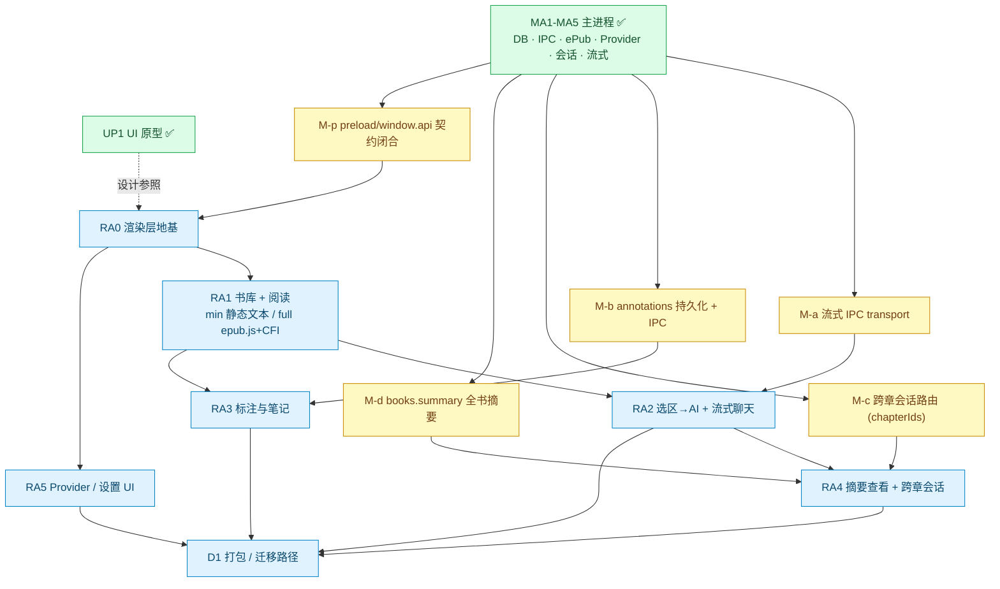
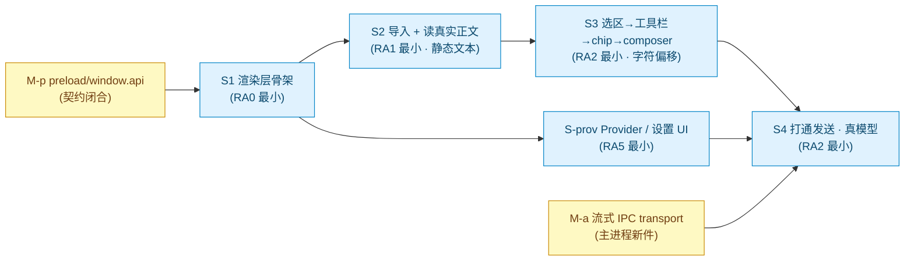

# Marginalia 渲染层轨任务分解（RA Track Decomposition）

> **性质**：里程碑级**任务分解 / 路线图**，是后续各子项目 `spec → plan → 实现` 的发散源，本身不含 bite-sized 步骤。
> **日期**：2026-06-01
> **状态**：分解定稿；推进策略已定（见 §2）；落 plan 前尚有设计选型待拍板（见 §7）。
> **关联**：
>
> - 设计：[`core-reading-loop-design`](../specs/2026-05-31-marginalia-core-reading-loop-design.md)、[`up1-ui-prototype-design`](../specs/2026-06-01-marginalia-up1-ui-prototype-design.md)
> - 已完成里程碑计划：[MA1](2026-05-31-marginalia-m1-foundation.md) · [MA2](2026-05-31-marginalia-ma2-epub-content.md) · [MA3](2026-05-31-marginalia-ma3-providers-secrets.md) · [MA4](2026-05-31-marginalia-ma4-conversation-prompt.md) · [MA5](2026-05-31-marginalia-ma5-streaming-orchestration.md)

---

## 1. 背景与基线

| 层                           | 状态                          | 说明                                                                                                                                                                 |
| ---------------------------- | ----------------------------- | -------------------------------------------------------------------------------------------------------------------------------------------------------------------- |
| **主进程 MA1–MA5**           | ✅ 完成且可 headless 测试     | DB/Drizzle schema · IPC 脊柱(Zod 单源) · ePub 解析(`packages/epub-parser`)+library 服务 · Provider/密钥(safeStorage) · 会话/Prompt 组装 · 流式 Agent 循环(`runSend`) |
| **UP1 UI 原型**              | ✅ 已并入 `main`（`ddc0aab`） | 隔离原型，验证选区→工具栏→chip→AI 问→流式→跨章路由等交互意图                                                                                                         |
| **渲染层 `src/renderer.ts`** | 🔴 仍为 Electron Forge 模板桩 | **最大缺口**——真实阅读器 / AI 界面尚未构建                                                                                                                           |

**已 spec / 已决策但未落地（deferred follow-ups）**：

- **M-a 流式 IPC transport**：`runSend` 已能 `streamText`，但增量推送到渲染层的 IPC 通道（含 `SendInput` Zod schema）未接。
- **M-b annotations 持久化**：设计已定但主进程尚未落 schema；需补 `annotations` 表 / 迁移 / repository / IPC + CFI 锚定（UP1 已有 UI）。
- **M-c 跨章会话路由**：`routeConversation` 仅支持单章（scalar `chapterId`），未扩展 `chapterIds[]`→独立会话。
- **M-d 全书摘要**：章节摘要已有；`books.summary` / `books.summaryStatus` schema、迁移、repository 与 IPC 尚未补。
- **M-p preload / window.api 契约闭合**：main 已注册多组 IPC handler，但 `preload.ts` 目前只暴露 `app.getInfo` / `ping`；渲染层竖切前需补齐按领域分组的 typed `window.api`。

> ⚠️ **文档漂移**：`CLAUDE.md` 仍写「MA2 = ePub 解析与内容，规划中」，实际 MA2 已完成，待更正。

---

## 2. 推进策略（已定）

- **最小可用竖切优先（vertical slice）**：先打通一条端到端「导入 → 读 → 选 → 问 → 流式回复」，拿到能真用的最小版；epub.js 分页/CFI、标注、跨章、摘要、i18n/主题、打包等**刻意推迟**。
- **AI 回复用真模型**，且**提前把 Provider 设置 UI 纳入竖切**（否则没有配置 key 的入口）。

---

## 3. 工作单元清单（全量 RA 轨 + 主进程补口 + 部署）

| 代号    | 名称                       | 内容要点                                                                                                                                                                | 依赖现有主进程                     |
| ------- | -------------------------- | ----------------------------------------------------------------------------------------------------------------------------------------------------------------------- | ---------------------------------- |
| **M-a** | 流式 IPC transport         | 定义 `ai:send` IPC（+`SendInput` Zod），`runSend` 的 `streamText` 增量经 IPC 推到渲染层                                                                                 | MA5 `runSend` ✅                   |
| **M-b** | annotations 持久化 + IPC   | `annotations` schema/迁移 → repository → IPC（增删改查）+ CFI 锚定                                                                                                      | UP1 UI 决策 ✅                     |
| **M-c** | 跨章 `routeConversation[]` | 路由扩展 `chapterIds[]` → 独立会话                                                                                                                                      | MA4 路由 ✅（单章）                |
| **M-d** | `books.summary` 全书摘要   | `books.summary` / `summaryStatus` schema/迁移 → repository/状态机 → IPC；生成逻辑仿章节摘要                                                                             | MA5 章节摘要 ✅                    |
| **M-p** | preload API 契约闭合       | 按领域暴露 `window.api.library/settings/chat/ai`，与 `shared/*` schema/DTO 对齐；RA 侧只消费 typed API，不直接手写 channel                                              | 现有 handlers ✅                   |
| **RA0** | 渲染层地基                 | Forge+Vite+React **重建**三栏 island shell（布局/主题/i18n/字体/Tailwind/typed `window.api`），替换桩。原型是 TanStack Start SPA，渲染层是 Electron——**移植适配非照搬** | M-p + shared/ipc 类型              |
| **RA1** | 书库 + 阅读                | import/list/open + TOC + 进度；分 `RA1-min`（静态章节文本，无 epub.js/CFI）与 `RA1-full`（真实 ePub 渲染/分页/CFI）                                                     | MA2 ✅ + M-p                       |
| **RA2** | 选区→AI + 流式聊天         | 渲染 ePub 上真实选区(**CFI**)→工具栏→chip→composer→send→流式                                                                                                            | MA4 `ai:build-chips` ✅ + M-a      |
| **RA3** | 标注与笔记                 | 高亮/便签 UI ↔ 持久化                                                                                                                                                   | RA1(选区/CFI) + M-b                |
| **RA4** | 摘要查看 + 跨章会话        | 章节/全书摘要弹卡 + 跨章独立会话                                                                                                                                        | M-c + M-d + RA2                    |
| **RA5** | Provider / 设置 UI         | 加 provider + key + 连通测试 + 默认 assistant 编辑                                                                                                                      | MA3 `providers:*`/`assistant:*` ✅ |
| **D1**  | 打包 / 迁移路径            | `electron-forge extraResources` 复制迁移 SQL（CLAUDE.md TODO）+ 首次真实启动联调                                                                                        | 全部                               |

---

## 4. 全局依赖 DAG



**关键约束**：`M-p` 是 `RA0` 前置，用来闭合 renderer 可消费的 typed API；`RA0` 是一切渲染工作的前置；`M-a/b/c/d` 在各自依赖的 `RA` 之前 just-in-time 插入；`RA3/RA4/RA5` 彼此独立可并行；`D1` 收尾。

---

## 5. 当前焦点：最小可用竖切

竖切是上表若干工作单元的**最小子集**（取 M-p + RA0/RA1/RA2/RA5 的最小可用切面 + M-a）：

| 代号       | 内容                                                                                                                          | 映射     | 验收                                        |
| ---------- | ----------------------------------------------------------------------------------------------------------------------------- | -------- | ------------------------------------------- |
| **M-p**    | preload / `window.api` 契约闭合：暴露竖切所需 library/settings/chat/ai API                                                    | M-p      | renderer 不直接手写 channel                 |
| **S1**     | 渲染层骨架：桩→React 挂载 + Tailwind + 最小两栏 + 消费 `window.api`                                                           | RA0 最小 | `pnpm start` 见空壳两栏                     |
| **S2**     | 导入 + 读真实正文：`library:import` 样例书 + `content:toc` / `content:chapter-text`，**静态渲染抽取文本**（不上 epub.js/CFI） | RA1 最小 | 能导入并读到真实书某章文字                  |
| **S3**     | 选区→工具栏→chip→composer：原型选区 + 浮动工具栏 + `ai:build-chips` 预填（**字符偏移**，不上 CFI）                            | RA2 最小 | 选词出工具栏；AI 问后面板出现 chips + 草稿  |
| **S-prov** | Provider/设置 UI：加 provider + key + 连通测试 + 选默认 assistant                                                             | RA5 最小 | 配好后 `resolveAssistantModel` 能解出真模型 |
| **M-a**    | 流式 IPC transport（主进程新件）                                                                                              | M-a      | 发送后逐字流式回来                          |
| **S4**     | 打通发送（真模型）：composer→`ai:send`→M-a 流式→消息列表增量                                                                  | RA2 最小 | **端到端**：导入→读→选→问→真流式回复        |



---

## 6. 刻意推迟（不在竖切内）

epub.js 真实分页 · CFI · 标注与笔记(RA3) · 跨章路由(M-c/RA4) · 全书摘要(M-d) · i18n / 主题 · 打包(D1)。

> 说明：`S2` 只完成 `RA1-min`（通过主进程 `content:toc` / `content:chapter-text` 静态渲染真实章节文本），不代表 `RA1-full` 完成；真实 epub.js/CFI 留给后续 `RA1-full` 或 RA3 前置工作。

---

## 7. 落 plan 前待拍板的设计选型

1. **M-a 流式 IPC transport（最关键）**：载体走 `webContents.send` 事件增量流，还是 `MessageChannelMain` 端口转移？渲染层消费走 **AI SDK v6 `useChat` + 自定义 transport**（与原型一致）还是手写最小 streaming hook？
2. **RA0 渲染层技术栈**：原型用 TanStack Start（带 SSR/路由），渲染层是 Electron——大概率落成**纯 React + Vite，无 router/无 SSR**；需确认状态管理（Context）、Tailwind 在 Forge/Vite renderer 的接法、字体（Manrope/Fraunces）。
3. **S-prov 范围**：最小到「加 provider + key + 连通测试 + 选默认 assistant」是否足够。

---

## 8. 后续流程

```
本分解(DAG) → 逐子项目 brainstorming → spec → writing-plans → subagent-driven 实现
```

竖切为当前焦点：先对 §7 选型做一轮设计，产出竖切 spec，再落 bite-sized plan。
